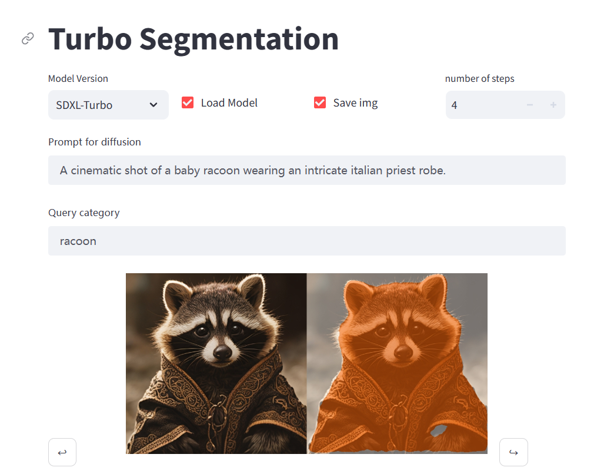

# IOSD: Improved Open-vocabulary Segmentation with Diffusion Models
Project of Multimodal Learning (PKU 2023 Autumn)

This project is based on [Grounded-Diffusion](https://github.com/Lipurple/Grounded-Diffusion), 
but we modified the whole code base because the original codes are hard to use.
We remained the idea and reconstructed the whole project based on official stable diffusion code base, 
so as to easy extension.

## Requirements
1. Install [pytorch](https://pytorch.org/) (we use 2.1.1 with cuda 11.8)
2. Install requirements, see instructions under `requirements\`
3. Make sure you have access to hugging face (If not, just put ```HF_ENDPOINT=https://hf-mirror.com``` before all commands bellow)

## Model Zoo
Put these models under `checkpoints` folder:
1. [diffusion model(sd_xl_turbo_1.0_fp16.safetensors)](https://huggingface.co/stabilityai/sdxl-turbo/tree/main)
2. [detection model](https://drive.google.com/file/d/1JbJ7tWB15DzCB9pfLKnUHglckumOdUio/view)
3. [segmentation module](https://pan.baidu.com/s/1JoL9KgOTPL-lwk_FUeK-pQ?pwd=t5go)

## Demo
After you have your seg_model, you can run a real-time web UI with following command:

```streamlit run demo.py```

Note: 
- The first time you start the UI demo, it need to download a pre-trained CLIP model from Hugging Face as well as load the models. It will take up to ten minutes.
- Please enter the prompt at once for each image, if you enter continuously, the interactive UI may crash because of too frequent inputs.

Cite: [Stablility-AI:generative-models](https://github.com/Stability-AI/generative-models)
## Train
Replace num with class split id, 1-3 belongs to PASCAL, 4-6 belongs to COCO.

```python train.py --exp_dir outputs/exps/exp$num$ --class_split $num$```

## Evaluate
Replace num with class split id, 1-3 belongs to PASCAL, 4-6 belongs to COCO.

```python evaluate.py --grounding_ckpt $path to segmentation module$ --exp_dir outputs/exps/exp$num$ --class_split $num$```
	
## Acknowledgements
Many thanks to the code bases from [Stable Diffusion](https://github.com/CompVis/stable-diffusion), [CLIP](https://github.com/openai/CLIP), [taming-transformers](https://github.com/CompVis/taming-transformers), [mmdetection](https://github.com/open-mmlab/mmdetection)
, [Stablility-AI:generative-models](https://github.com/Stability-AI/generative-models)
